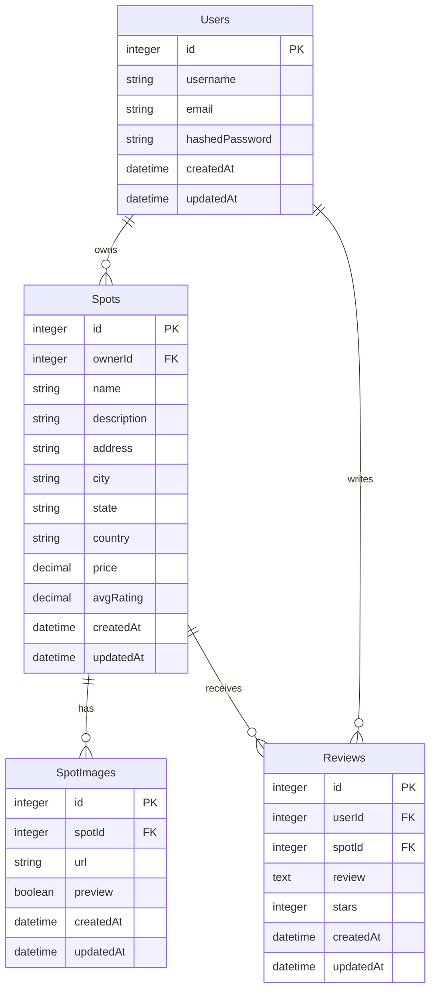

```mermaid
erDiagram
    Users {
        integer id PK
        string username
        string email
        string hashedPassword
        datetime createdAt
        datetime updatedAt
    }
    
    Spots {
        integer id PK
        integer ownerId FK
        string name
        string description
        string address
        string city
        string state
        string country
        decimal price
        decimal avgRating
        datetime createdAt
        datetime updatedAt
    }
    
    SpotImages {
        integer id PK
        integer spotId FK
        string url
        boolean preview
        datetime createdAt
        datetime updatedAt
    }
    
    Reviews {
        integer id PK
        integer userId FK
        integer spotId FK
        text review
        integer stars
        datetime createdAt
        datetime updatedAt
    }
    
    Users ||--o{ Spots : "owns"
    Users ||--o{ Reviews : "writes"
    Spots ||--o{ SpotImages : "has"
    Spots ||--o{ Reviews : "receives"
``` 